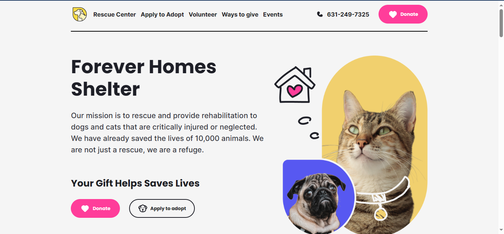

# Forever Homes Shelter
<p align="center">

</p>

## Why? 🤔
To measure abilities, fix the knowledge from the lectures and to exercise the programming logic with a situation similar to the market, this project was proposed as a chalenge to the PB's students.

## Objectives 🎯

### Main
-   [x] Page Development
-   [x] Animal Exhibition
-   [x] Newsletter subscription form
-   [x] Style and Layout

### Extra mile 
-   [x] Typescript
-   [x] README

## Instalation 💻

To use it,choose a folder where it will be cloned or repository, open the / cmd terminal and use the * git * command below:
```
git clone https://github.com/JuanGustah/FHS-Compass.git
```
After that,run the folowing comand to instal the dependencies:
```
npm install
```
Finally, you can run the folowing comand to start the project:
```
npm start
```
